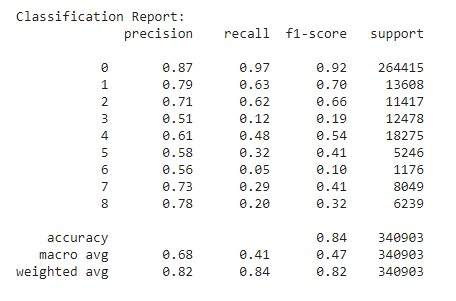

# Custom-NER-System-Design-Using-LSTM

Used SpaCy and Stanford NER (Stanza) to annotate the data and tried various embedding techniques to train LSTM based named entity recognition model.

**Data**
- Used Newsroom data from `sklearn.datasets`  
- Number of data samples ~18k and we used train:test split of 80:20.
- Annotated the data using Spacy and Stanza using BIOS encoding. For creating annotated documents we have considered only three entities and they are PERSON, LOC and ORG and all the other entities are considered as MISC. Here, we have converted text into tokens for annotating. 
```
'PER' for person
'ORG' for organization
'LOC' for location
'MISC' for miscellaneous
```
For the NER tags, there are four labels for NER, each prefixed with 'B-' (for beginning) or 'I-' (for intermediate), that indicate if the token is the first one for the current group with the label or not. So the labels will be: `['O', 'B-PER', 'I-PER', 'B-ORG', 'I-ORG', 'B-LOC', 'I-LOC', 'B-MISC', 'I-MISC']`

Overall stats:
```
  {
    'B-LOC': 45374,
    'B-MISC': 81797,
    'B-ORG': 101227,
    'B-PERSON': 101939,
    'I-LOC': 10972,
    'I-MISC': 58725,
    'I-ORG': 125863,
    'I-PERSON': 90294,
    'O': 2116006
  }
```

**Model**
- Trained Bi-LSTM model using 3 different word embeddings:
    - Fasttext
    - GloVe
    - word2vec
- Scores on all three embeddings were mostly similar but GloVe embeddings perform slightly better.

    


Please check the attached notebook for more details.

